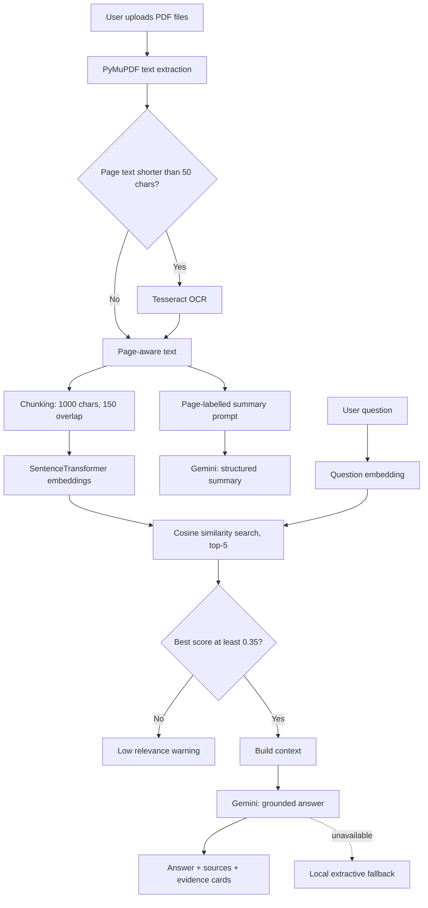

Readme · MD
<div align="center">


<h1>ASTRA INTEL</h1>

<h3>AI-Powered Defence Document Intelligence System</h3>

<p>Upload defence or research PDFs, search them semantically, and get <b>grounded answers with page-level evidence</b>.</p>

<a href="https://astra-intel-bmsit.streamlit.app">
  
</a>

<p><b>Live demo:</b> <a href="https://astra-intel-bmsit.streamlit.app">astra-intel-bmsit.streamlit.app</a></p>


</div>
---
 
## Table of Contents
 
- [Overview](#overview)
- [Key Features](#key-features)
- [System Architecture](#system-architecture)
- [How It Works](#how-it-works)
- [Tech Stack](#tech-stack)
- [Project Structure](#project-structure)
- [Getting Started](#getting-started)
- [Configuration](#configuration)
- [Usage Guide](#usage-guide)
- [Design Decisions](#design-decisions)
- [Known Limitations](#known-limitations)
- [Security and Data Privacy](#security-and-data-privacy)
- [Troubleshooting](#troubleshooting)
- [Roadmap](#roadmap)
- [Contributing](#contributing)
- [Team](#team)
- [License](#license)
---
 
## Overview
 
**ASTRA INTEL** is a Retrieval-Augmented Generation (RAG) application built for the **ASTRA Software Team**. It lets analysts, students and researchers work with large collections of defence and technical PDFs without reading them page by page.
 
The system extracts text from PDFs (falling back to **OCR** for scanned pages), splits it into overlapping chunks, embeds those chunks with a sentence-transformer model, and retrieves the most relevant passages for any question. **Google Gemini** then produces a concise answer using *only* the retrieved context. Every answer is shown together with its supporting evidence, document name and page number.
 
> **Design goal:** answers must be traceable. If the documents do not support an answer, ASTRA INTEL says so instead of guessing.
 
---
 
## Key Features
 
| Feature | Description |
|---|---|
| **Multi-PDF ingestion** | Upload and query several documents at once. |
| **Hybrid text extraction** | Native text extraction via PyMuPDF with automatic OCR fallback for scanned or image-only pages. |
| **Semantic search** | Meaning-based retrieval using `all-MiniLM-L6-v2` embeddings and cosine similarity. |
| **Grounded Q&A** | Gemini answers strictly from retrieved context, with a fixed refusal message when evidence is missing. |
| **Page-level evidence** | Each answer lists the retrieved sections with filename, page number and similarity score. |
| **Structured AI summaries** | Per-document summary with Executive Summary, Key Points, Main Topics and Important Details, each citing real page numbers. |
| **Citation validation** | Page citations produced by the model are checked against the pages that actually exist in the PDF. |
| **Conversation memory** | The last five turns are passed to the model to resolve follow-up questions. They are treated as context, not as evidence. |
| **Resilient LLM calls** | Model fallback chain with exponential backoff for transient errors (429, 5xx, timeouts). |
| **Offline fallbacks** | Local extractive summary and answer when Gemini is unavailable. |
| **Custom dark UI** | Styled Streamlit interface with hero section, metric cards and evidence cards. |
 
---
 
## System Architecture
 

 
---
 
## How It Works
 
### 1. Ingestion and OCR
Each page is read with PyMuPDF. If the extracted text is shorter than `OCR_MIN_TEXT_LENGTH` (50 characters) and Tesseract is installed, the page is rendered at 2x resolution and passed through OCR. The longer of the two results is kept, and the method used (`Text Extraction` or `OCR`) is recorded per page.
 
### 2. Chunking
Text is whitespace-normalised and split into **1000-character chunks with 150 characters of overlap**, so facts that cross a boundary are not lost. Every chunk keeps its `filename` and `page` metadata.
 
### 3. Embedding and retrieval
Chunks are encoded with `all-MiniLM-L6-v2`. A question is embedded the same way and compared against all chunks with cosine similarity. The top five chunks are returned with their scores.
 
### 4. Relevance gate
If the best similarity score is below `MIN_SIMILARITY` (0.35), the app warns the user instead of sending weak context to the LLM.
 
### 5. Grounded answer generation
The retrieved chunks are assembled into a context block (capped at `MAX_CONTEXT_CHARS`) and sent to Gemini with strict rules:
 
1. Use only the retrieved context.
2. Do not invent facts, numbers, names, pages or documents.
3. If unsupported, reply exactly: *"I could not find the answer in the uploaded documents."*
4. Previous conversation is for understanding only and is not evidence.
### 6. Page-aware summaries
For each PDF, the full text is sent with `[Page N]` markers. The model must end every bullet with a citation such as `[Page 3]` or `[Pages 2, 5]`. Citations are then validated against real page numbers and invalid ones are removed. Very long documents are sampled from the beginning, middle and end to stay within `MAX_SUMMARY_CHARS`.
 
### 7. Failure handling
`call_gemini` walks through a list of models, retrying each up to three times with exponential backoff on transient errors. If all fail, the UI falls back to a local extractive summary or answer and displays the technical error.
 
---
 
## Tech Stack
 
| Layer | Technology |
|---|---|
| Interface | [Streamlit](https://streamlit.io/) with custom CSS |
| PDF parsing | [PyMuPDF](https://pymupdf.readthedocs.io/) (`fitz`) |
| OCR | [Tesseract](https://github.com/tesseract-ocr/tesseract) via `pytesseract`, `Pillow` |
| Embeddings | [Sentence-Transformers](https://www.sbert.net/) (`all-MiniLM-L6-v2`) |
| Similarity | `scikit-learn` cosine similarity |
| LLM | [Google Gemini](https://ai.google.dev/) via `google-genai` |
| Configuration | `python-dotenv` |
 
---
 
## Project Structure
 
```text
astra-intel/
├── app.py                 # Main Streamlit application
├── test_gemini.py         # Standalone Gemini API smoke test
├── requirements.txt       # Python dependencies
├── .env                   # Local secrets (not committed)
├── .gitignore
├── README.md
└── assets/
    └── astra_logo.jpeg    # Logo shown in the hero section
```
 
> Adjust file names to match your repository. The code expects the logo at `assets/astra_logo.jpeg` and falls back to a shield emoji if it is missing.
 
`app.py` is organised into numbered sections: page config, custom UI, environment and Gemini setup, OCR config, constants and session state, embedding model, header, helper functions, upload, PDF processing, document status, AI summary, embeddings, chat history, question answering, document content viewer and footer.
 
---
 
## Getting Started
 
### Prerequisites
 
- **Python 3.10 or newer**
- **A Gemini API key** from [Google AI Studio](https://aistudio.google.com/)
- **Tesseract OCR** (optional, required only for scanned PDFs). This is a system program and is **not** installed by `pip`.
### 1. Clone the repository
 
```bash
git clone https://github.com/suryanshraj2029/astra-intel.git
cd astra-intel
```
 
### 2. Create a virtual environment
 
```bash
python -m venv venv
 
# Windows
venv\Scripts\activate
 
# macOS / Linux
source venv/bin/activate
```
 
### 3. Install dependencies
 
```bash
pip install -r requirements.txt
```
 
The first run downloads the `all-MiniLM-L6-v2` model (about 90 MB), so an internet connection is needed once.
 
### 4. Install Tesseract (for OCR)
 
| OS | Command / link |
|---|---|
| Windows | Install from the [UB Mannheim builds](https://github.com/UB-Mannheim/tesseract/wiki). The app looks for `C:\Program Files\Tesseract-OCR\tesseract.exe`. |
| Ubuntu / Debian | `sudo apt install tesseract-ocr` |
| macOS | `brew install tesseract` |
 
If Tesseract is not found, the app still works for text-based PDFs and shows a notice that OCR is unavailable.
 
### 5. Configure the API key
 
Create a `.env` file in the project root:
 
```env
GEMINI_API_KEY=your_api_key_here
```
 
### 6. Verify the Gemini connection (optional)
 
```bash
python test_gemini.py
```
 
### 7. Run the app
 
```bash
streamlit run app.py
```
 
Open the URL shown in the terminal (usually `http://localhost:8501`).
 
---
 
## Configuration
 
Tunable values live near the top of `app.py`.
 
| Constant | Default | Purpose |
|---|---|---|
| `MIN_SIMILARITY` | `0.35` | Minimum best-match score before answering. |
| `MAX_CONTEXT_CHARS` | `18000` | Maximum retrieved context sent to Gemini. |
| `MAX_SUMMARY_CHARS` | `100000` | Maximum document text sent for summarisation. |
| `OCR_MIN_TEXT_LENGTH` | `50` | Pages with less text than this trigger OCR. |
| `TESSERACT_PATH` | Windows default path | Path to the Tesseract executable. Change it for your OS. |
| `chunk_size` / `overlap` | `1000` / `150` | Chunking parameters in `create_chunks`. |
| `top_k` | `5` | Number of chunks retrieved per question. |
| `models_to_try` | see `call_gemini` | Ordered Gemini model fallback list. |
 
**Choosing Gemini models:** confirm the exact model names available to your key before deployment:
 
```python
from google import genai
client = genai.Client(api_key="YOUR_KEY")
print([m.name for m in client.models.list()])
```
 
Use names from that list in `models_to_try`. Make sure `google-genai` is up to date, since `thinking_config` / `thinking_level` requires a recent SDK version.
 
---
 
## Usage Guide
 
1. **Upload** one or more PDFs in the *Upload Documents* section.
2. Check **Document Status** for the PDF count, page count, text chunks and OCR pages.
3. Read the **AI Document Summary** for each file, with page citations.
4. Wait for the message confirming semantic search is ready.
5. **Ask a question** in the *Ask ASTRA INTEL* box.
6. Review the **Evidence Retrieved** cards, the generated **answer** and the **sources** line.
7. Use **Clear Chat** to reset conversation history.
8. Expand **Document Content** to read the extracted text page by page and see whether each page used text extraction or OCR.
**Example questions**
 
- *What is the main objective of this document?*
- *Which methods are described for signal processing?*
- *What requirements are listed for the system on page 4?*
---
 
## Design Decisions
 
- **Grounding over fluency.** The strict prompt and the similarity gate prioritise correctness and traceability over always producing an answer.
- **Local embeddings.** Retrieval runs on the user's machine. Only the retrieved context and summary text are sent to Gemini.
- **Page metadata everywhere.** Every chunk and summary is tied to a real page number so citations can be verified.
- **Graceful degradation.** Missing OCR, missing API key or Gemini outages never crash the app. Each has a defined fallback.
- **Citation sanitising.** Page numbers produced by the model are validated against actual pages before being shown.
---
 
## Known Limitations
 
- Streamlit re-executes the script on each interaction. Without caching, extraction, summaries and embeddings are recomputed, which affects speed and API quota. See the [Roadmap](#roadmap).
- Embeddings are held in memory only, so very large document sets will use significant RAM and nothing persists between sessions.
- Retrieval is dense-only (no keyword or hybrid search), so exact identifiers and part numbers can be missed.
- Retrieval does not yet use chat history, so vague follow-ups may retrieve poorly.
- OCR quality depends on scan quality. Tables, diagrams and handwriting are not interpreted.
- Top-5 retrieval is global, so one document can dominate results when several are loaded.
- The local fallback is extractive and much less capable than the Gemini answer.
---
 
## Security and Data Privacy
 
- **API key:** keep it in `.env` and never commit it. Add `.env` to `.gitignore`.
- **External processing:** document text used for summaries and answers is sent to Google's Gemini API. **Confirm that this is permitted for the classification level of your documents before use.** Do not upload classified or export-controlled material to a third-party cloud service without authorisation.
- **For sensitive deployments,** consider replacing the Gemini call with a locally hosted LLM so no document content leaves your network.
- **Output rendering:** retrieved text and answers are HTML-escaped before display to prevent markup injection from document content.
Suggested `.gitignore` entries:
 
```gitignore
.env
venv/
__pycache__/
*.pyc
```
 
---
 
## Troubleshooting
 
| Problem | Likely cause and fix |
|---|---|
| `Gemini client is not available` | `GEMINI_API_KEY` is missing or `.env` is not in the working directory. |
| Summary always shows the local fallback | Model names in `models_to_try` may be invalid or unavailable to your key. List models as shown in [Configuration](#configuration). Check the technical error message. |
| `429` / `RESOURCE_EXHAUSTED` | Quota exceeded. Wait, reduce reruns, or use a different model or plan. |
| OCR Pages shows `0` for a scanned PDF | Tesseract is not installed or `TESSERACT_PATH` is wrong for your OS. |
| `TesseractNotFoundError` | Install Tesseract and make sure it is on `PATH` or set `TESSERACT_PATH`. |
| Very slow after each question | Extraction, summary and embedding steps are rerunning. Add caching as described in the Roadmap. |
| Logo not displayed | Place the image at `assets/astra_logo.jpeg`. |
| First startup is slow | The embedding model is downloading and loading once. |
 
---
 
## Roadmap
 
- [ ] Cache PDF extraction and embeddings with `st.cache_data`, and keep summaries in `st.session_state`
- [ ] Use `st.form` or `st.chat_input` so questions run only on submit
- [ ] Rewrite follow-up questions using chat history before retrieval
- [ ] Per-document retrieval quotas for fairer multi-PDF search
- [ ] Hybrid retrieval (BM25 plus embeddings) with re-ranking
- [ ] Persistent vector store (FAISS or ChromaDB)
- [ ] Table and image understanding for diagrams in PDFs
- [ ] Export summaries and answers to PDF or DOCX
- [ ] Support for DOCX, TXT and image inputs
- [ ] Optional local LLM backend for air-gapped use
- [ ] Docker image and CI pipeline
- [ ] Automated tests for chunking, citation cleaning and retrieval
---
 
## Contributing
 
Contributions are welcome.
 
1. Fork the repository
2. Create a feature branch: `git checkout -b feature/your-feature`
3. Commit your changes: `git commit -m "Add your feature"`
4. Push the branch: `git push origin feature/your-feature`
5. Open a Pull Request describing the change and how you tested it
Please keep code consistent with the existing section layout and avoid committing secrets or sample documents that are not cleared for sharing.
 
---
 
## Team
 
Developed by the **ASTRA Software Team**.
 
| Name | Role |
|---|---|
| _Your Name_ | _Lead Developer_ |
| _Teammate_ | _Role_ |
 
---
 
## License
 
Distributed under the **MIT License**. See `LICENSE` for details.
(Replace with your chosen license if different.)
 
---
 
<div align="center">
**ASTRA INTEL** &nbsp;•&nbsp; AI-Powered Defence Document Intelligence<br>
Document-grounded analysis &nbsp;•&nbsp; Page-aware evidence &nbsp;•&nbsp; OCR support
 
</div>
 
